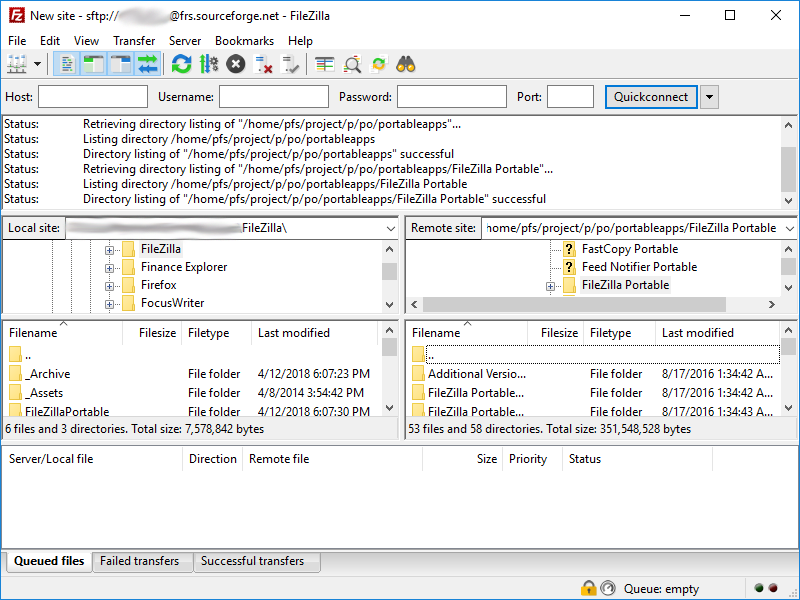

# ProFTPD + LDAP

O relatório a seguir apresenta a configuração de um servidor FTP para autenticação em uma base LDAP já existente.Para o servidor FTP utilizaremos o ProFTPD e a base ldap foi configurada com a utilização do OpenLDAP. Nesse relatório não será abordado a criação da base LDAP que será utilizada mas suas peculiaridades serão informadas conforme o autor achar necessário. Primeiro vamos configurar um cliente para o banco LDAP, para isso instale os pacotes:

```dart
# yum install epel-release
# yum update
# yum install openldap-clients ldapvi
```

Caso o seu servidor DNS não responde pela base LDAP que está utilizando, insira seu endereço no arquivo /etc/hosts e assim utilizaremos apenas nome ldap1 nos comandos subsequentes.

```dart
# echo “0.0.0.0 ldap1 myldap.server” >> /etc/hosts
```

Após isso já é possível testar as consultas para a base que contém os usuários de nosso serviço FTP.

```dart
# ldapsearch -LLL -D cn=usuario,dc=base,dc=com -H ldap://ldap1 -b ou=Usuarios,dc=base,dc=com -W
```

Ao usar o comando acima será perguntada a senha do usuário que realizou a busca e se for um usuário apto a realizar tal busca a mesma retornará todos os dados da “tabela” Usuários. Se o passo estiver ok, vamos passar para a configuração de nosso servidor.

Antes de instalar o servidor ProFTPD, primeiro desative o firewall e o selinux para evitar erros estranhos e desnecessários

```dart
# systemctl stop firewalld.service
# systemctl disable firewalld.service
```

```dart
# vi /etc/selinux/config
```



* Neste mude o valor da chave SELINUX para disabled. É necessária a reiniciar o sistema para essa configuração ter efeito.



Agora instale os pacotes proftpd e proftpd-ldap através do yum

```dart
# yum install proftpd proftpd-ldap
```

Crie um usuário de testes e baixe o cliente FTP FileZilla para realização de testes.

* Criando usuário:

```dart
# useradd teste
# passwd teste
```

* Iniciando serviço:

```dart
# systemctl start proftpd
# systemctl enable proftpd
```

* Cliente FilleZilla:

[https://filezilla-project.org/download.php ](https://filezilla-project.org/download.php%20)



Se você conseguiu se conectar está na hora de realizarmos a configuração final de nosso servidor. Primeiro realize um backup do arquivo /etc/proftpd.conf para poder retornar a configuração inicial sempre que necessário.

```dart
# mv /etc/proftpd.conf /etc/bak.proftpd.conf
```

O processo de autenticação do ProFTPD também utiliza o pam, portanto será necessário uma pequena configuração no arquivo /etc/pam.d/proftpd


```dart
#%PAM-1.0
auth    required        pam_listfile.so item=user sense=deny  file=/etc/ftpusers onner=succeed

@include common-auth
@include common-account
@include commom-session
```


Depois zere o conteúdo do arquivo `# echo “” > /etc/`proftpd.conf pois iremos realizar a configuração completa do arquivo. A primeira coisa a se fazer é importar os módulos que farão controle de ACL’s de nosso servidor.


```dart
ModuleControlsACLs insmod,rmmod allow user root
ModuleControlsACLs lsmod allow user *

...
```


Agora vamos importar os módulos que utilizaremos durante as próximas configurações. Os módulos que se encontram comentados são por padrão importados na versão do ProFTPD utilizada para criação desse relatório, se na versão em que estiver utilizando-o não for assim basta descomentar as linhas.


```dart
...
LoadModule mod_ctrls_admin.c
##LoadModule mod_dso.c
##LoadModule mod_tls.c
LoadModule mod_ldap.c
LoadModule mod_quotatab.c
LoadModule mod_quotatab_file.c
LoadModule mod_quotatab_ldap.c
LoadModule mod_wrap.c
LoadModule mod_rewrite.c

...
```


O último módulo que precisa ser importado nos permite realizar verificações para evitar erros em tempo de execução. Como por exemplo saber se um módulo foi importado corretamente. Como a importação dos módulos acabou, aproveite para desabilitar o uso de IPv6 na linha seguinte.


```dart
...
LoadModule mod_ifsession.c

UseIPv6                 off

...
```


Nas linhas seguintes podemos configurar o nome do nosso servidor, tipo de sua execução e definir se ele será um servidor de boas-vindas \(não será\).


```dart
...
ServerName              "proftp.ldap.tarlles"
ServerType              standalone
DeferWelcome            off

...
```


Vamos definir também que o servidor irá funcionar de acordo com a RFC2228, será o servidor FTP padrão em nossa rede, o único, e que ele não irá mostrar links simbólicos.


```dart
...
MultilineRFC2228        on
DefaultServer           on
ShowSymLinks            off

...
```


Alguns timeouts também podem serão definidos para realizar o controle de carga de nosso servidor. E como o texto anterior ficou curto, vamos aproveitar para configurar uma mensagem de boas vindas, o atalho para exibir as opções fornecidas pelo servidor que estamos configurando e iremos bloquear o filtro que busca por tudo.


```dart
...
TimeoutNoTransfer       600
TimeoutStalled          600
TimeoutIdle             300

DisplayLogin            welcome.msg
ListOptions             "-l"
DenyFilter              \*.*/

...
```


Com as linhas abaixo iremos realizar as últimas configurações básicas necessárias, porém o servidor ainda não estará autenticando seus usuários na base ldap, para que isso ocorra aguarde as próximas configurações. Nas linhas abaixo são configurados: porta padrão; quantidade máxima de conexões, usuário e grupo que executará o serviço, umask padrão para arquivos e diretórios que possivelmente serão criados; vamos permitir sobrescritas e definir caminhos para arquivos de log; além de desativar a opção de guardar senhas em cache.


```dart
...
Port                    21
MaxInstances            15
User                    ftp
Group                   ftp
Umask                   022     022

AllowOverwrite          on
PersistentPasswd        off
TransferLog             /var/log/proftpd/xferlog
SystemLog               /var/log/proftpd/proftpd.log

...
```


Use o módulo mod\_tls.c se desejar que a conexão e transferencia de dados seja criptografada. Para isso é necessário a criação de uma chave privada e um certificado que possa ser trocado com o cliente. Sugerimos que esses arquivos sejam guardados em /etc/proftpd/ssl/.


```dart
...
<IfModule mod_tls.c>
TLSEngine on
TLSLog  /var/openftpd/tls.log

TLSProtocol     TLSv1
TLSRSACertificateFile /etc/proftpd/ssl/cert-tarlles_ftp.pem
TLSRSACertificateKeyFile /etc/proftpd/ssl/key-tarlles_ftp.pem

TLSRenegotiate none
</IfModule>

...
```


Agora utilize os módulos mod\_quota.c, mod\_ratio.c, mod\_delay.c para permitir que sejam aplicadas quotas ao usuário que está se conectando.


```dart
...
<IfModule mod_quota.c>
QuotaEngine on
</IfModule>

<IfModule mod_ratio.c>
Ratios on
</IfModule>

<IfModule mod_delay.c>
DelayEngine on
</IfModule>

...
```


Utilize o módulo mod\_ctrls.c para definir caminho para arquivos de logs e quantos clientes podem se conectar em um determinado intervalo de tempo.


```dart
...
<IfModule mod_ctrls.c>
ControlsEngine          on
ControlsMaxClients      2
ControlsLog             /var/log/proftpd/controls.log
ControlsInterval        5
ControlsSocket          /var/run/proftpd/proftpd.sock
</IfModule>

...
```


Por fim utilize o mod\_ctrls\_admin.c para criar uma “jaula” para o usuário, dessa maneira o mesmo não poderá percorrer todo o sistema de arquivos.


```dart
...
<IfModule mod_ctrls_admin.c>
AdminControlsEngine on
DefaultRoot ~
AllowChrootSymLinks off
</IfModule>

...
```


Por último porém de extrema importância configure a base LDAP ao qual o servidor deverá buscar informações. Além de ligar a criação de diretórios Home automáticas.


```dart
...
CreateHome on

LDAPServer      ldap1
LDAPAuthBinds     on
LDAPBindDN      cn=usuario,dc=base,dc=com  senha
LDAPUsers       ou=Usuarios,dc=base,dc=com
```


Feche o arquivo e reinicie o serviço, agora ele deverá ser capaz de autenticar usuários na base LDAP utilizada na configuração, se esses usuários forem da classe objeto posixAccount e possuírem atributos que sejam compatíveis com os que são listados em arquivos como /etc/passwd e /etc/shadow.

```dart
# systemctl stop proftpd
# systemctl start proftpd
```

### Referências:

* [http://www.proftpd.org/docs/contrib/mod\_ldap.html](http://www.proftpd.org/docs/contrib/mod_ldap.html) - acesso em: 24/11/2019
* [http://www.proftpd.org/docs/howto/Chroot.html](http://www.proftpd.org/docs/howto/Chroot.html) - acesso em: 24/11/2019
* [http://www.proftpd.org/docs/howto/TLS.html](http://www.proftpd.org/docs/howto/TLS.html) - acesso em: 24/11/2019

